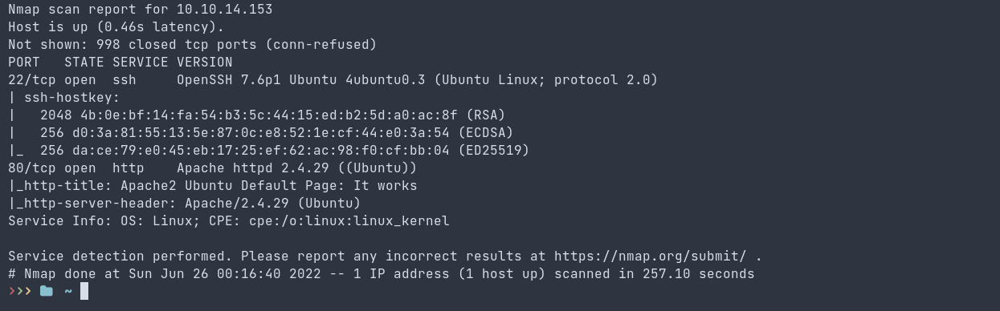
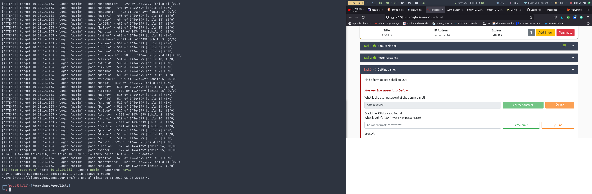
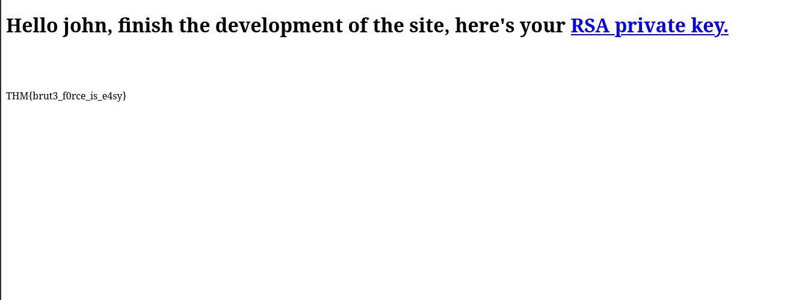
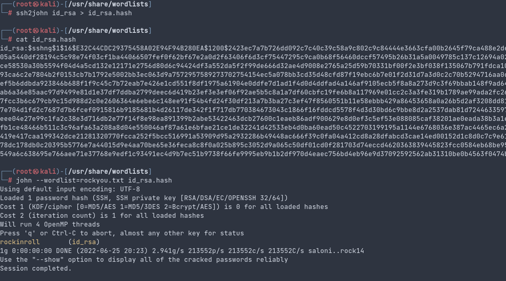
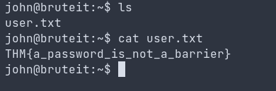
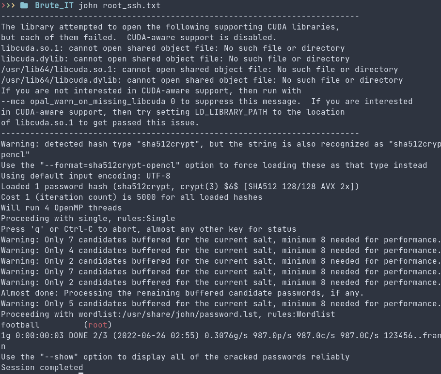
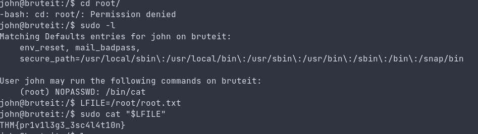

## This is an easy and simple room for all the begineers on CTF. This is a room from THM with the main focus on hash cracking and privelege escallation technique.

**First we will look out the open ports with their version and vulnerability if any found. For the nmap tool comes into act.**

**And there we can see that the two ports i.e ssh and http are open. I first look-out the http service and it shows nothing important to me. I lookup the source code too but there was nothing that might help ahead. So instead I look after the next directory with gobuster.
I found the new directory and got redirect to the login page with its username and the password. To bypass the that login i need some credentials. I lookup the source code and then I found there a user and with its username. Now i just need to search for the exact password and for cracking the password with bruteforcing I use hydra.
hydra for the http-post (from source page method is POST)**

**and there it is, the username and the password of the user. No we login into the http page and we can find the web_flag and the rsa_key which is lead to the ssh login**

**The RSA private key needs to be decrypted for ssh login. And JohnTheRipper easily solve our problem for that. For that it needs to be converted to hash such a way that it can further be decrypted by JTR tool and give us the password for ssh login.**

**And now we can easily login to the ssh shell for gaining our remaining flag. But most of the time I forget to login changing the permission on rsa decrypted code. It first need to be rw---- access (chmod 400) so that we can login to the ssh shell. The ssh login cmd goes by:**

***ssh -i id_rsa host@IP***

Now we are into the user shell

**We get the user flag. We look for the privelege escallation technique with sudo and SUID . We can see that the sudo command gives us the lead to execute the root for cat cmd. So, now we can access the cat cmd to get the root shell. But, it also asks for the user password. The userid and the password is located on the passwd file. We have cat cmd that can bypass the root level access. We then copy the root passwd file. Again we can bruteforce the root password using john tool.**

**Here we get the root password. Further We can easily access the root flag. But I used the cmd privelege escallation method and get the root flag as shown in the below:**

### and This is it!! You just completed the room :D
