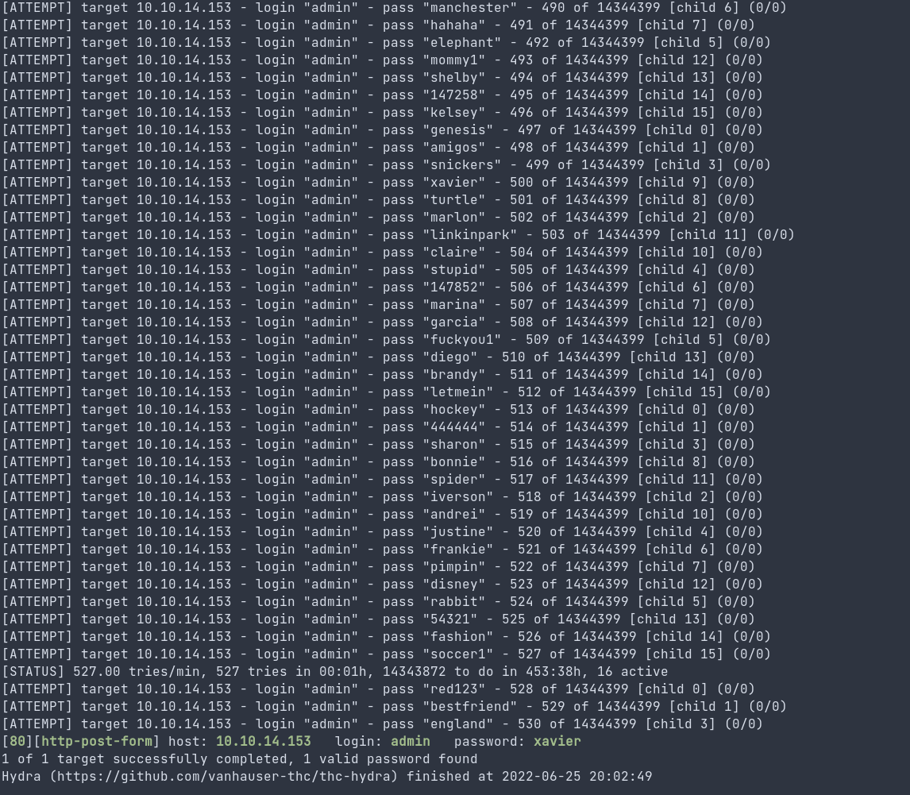

## This is an easy and simple room for all the begineers on CTF. This is a room from THM with the main focus on hash cracking and privelege escallation technique.

**First we will look out the open ports with their version and vulnerability if any found. For the nmap tool comes into act.**

And there we can see that the two ports i.e ssh and http are open. I first look-out the http service and it shows nothing important to me. I lookup the source code too but there was nothing that might help ahead. So instead I look after the next directory with gobuster.
I found the new directory and got redirect to the login page with its username and the password. To bypass the that login i need some credentials. I lookup the source code and then I found there a user and with its username. Now i just need to search for the exact password and for cracking the password with bruteforcing I use hydra.
hydra for the http-post (from source page method is POST)

